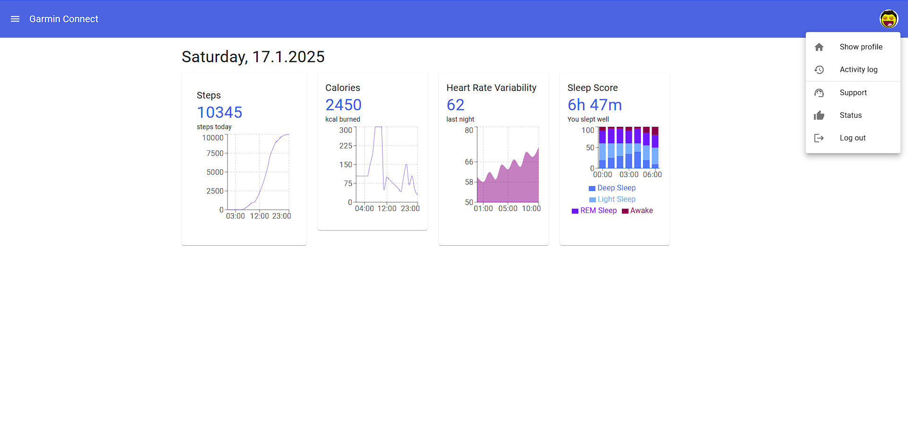
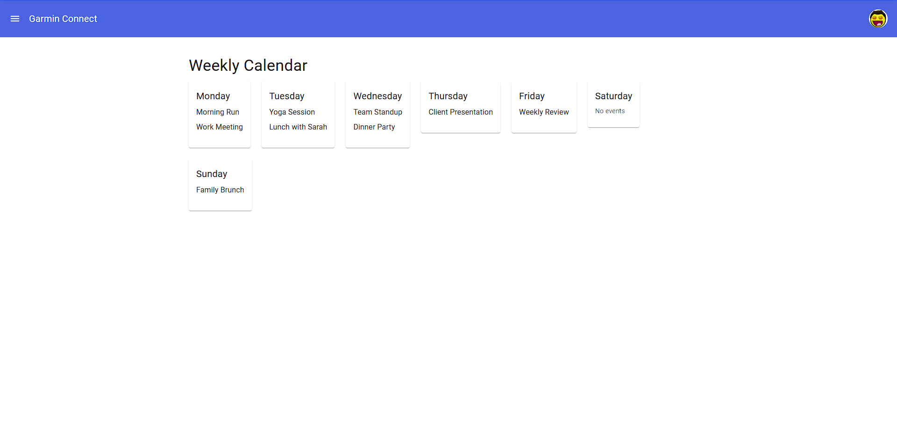
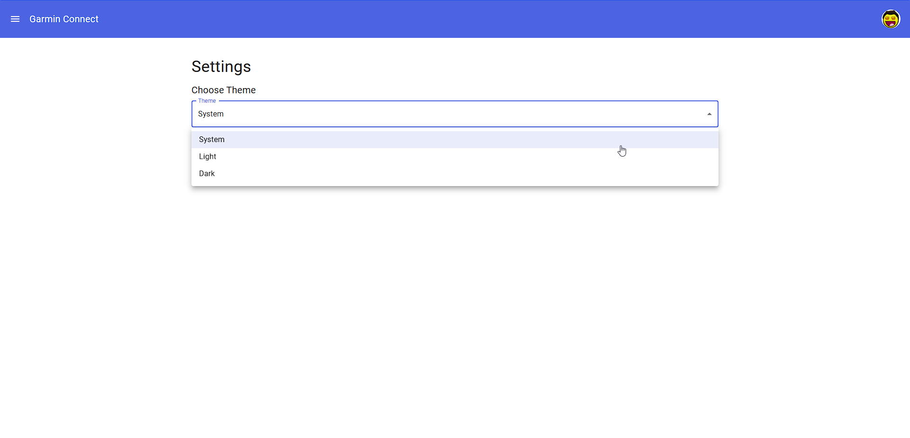
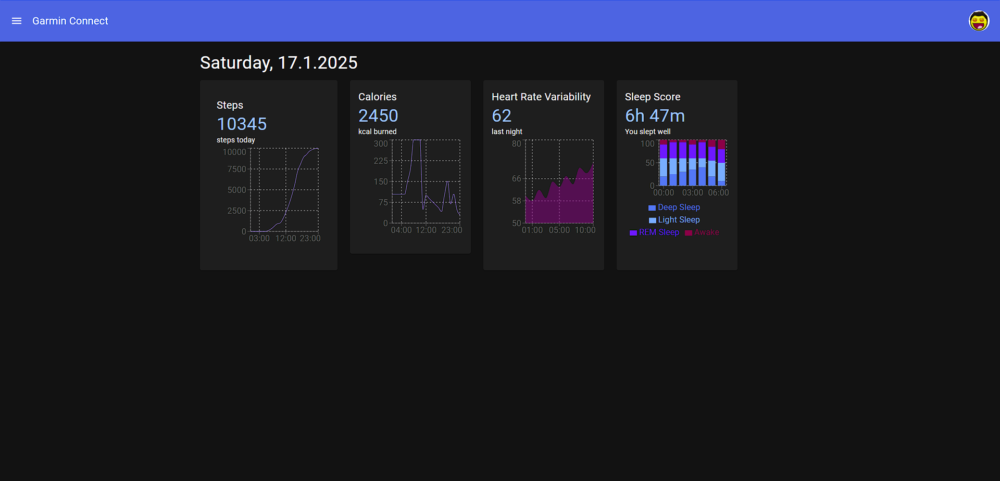
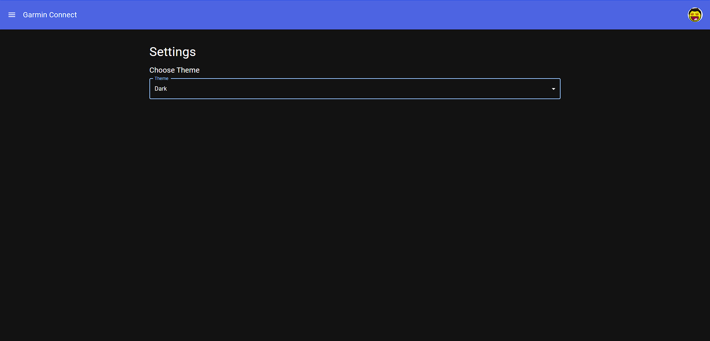
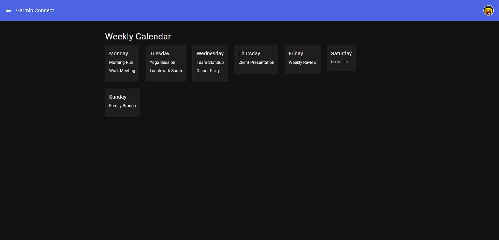

# Arbeidskrav 1/2: React Component Development and Demo  

This is a solution to an assignment delegated in the course APP2000. The assignment is as quoted:

> ### Objective  
> This assignment ensures that each team member develops foundational skills in React by creating individual components and presenting their functionality.  
>
> ### Instructions  
> 1. Develop Individual Components  
>   - Each team member should design and code 4-5 React components related to the team project (e.g., a "MenuItem" component for displaying restaurant items or a "SearchBar" for filtering options).  
>   - Components should be functional but do not need to connect to the overall project or backend at this stage.  
> 2. Usage demo  
>   - Prepare a short demo showcasing the usage and structure of your components. Take screenshots and save them in a document for submission.
>   - The demo should include:
>     - A brief explanation of each component's purpose.
>     - A walkthrough of the props, state, and any logic implemented within the component.
> 3. Submission guidelines  
>   - Submit your component files along with a brief document that explains their intended functionality, props, and any challenged you faced. (All in a .zip file.)  
>   - Each team member's submission should be individual and cover their specific contributions.  
> ### Evaluation  
> This assignment focuses on individual React proficiency, component structure, and clarity of explanation during the demo.  

---

## Table of contents
- [What is a component in React?](#what-is-a-component-in-react-)
- [App.jsx](#appjsx)
  - [useState](#usestate-for-popover)
- [Sidebar](#sidebar)
  - [useState](#usestate-for-sidebar)
  - [toggleSidebar](#togglesidebar)
- [List](#list)
- [Calendar.jsx](#calendarjsx)
- [Settings.jsx](#settingsjsx)
- [setThemeMode](#setthememode)
- [Challenges](#challenges)

---

### What is a component in React?  
> `Component` is the base class for the React components defined as JavaScript classes.  
> _-- [React.dev](https://react.dev/reference/react/Component)_
> > Classes are a template for creating objects. They encapsulate data with code to work on that data. Classes in JS are built on prototypes but also have some syntax and semantics that are unique to classes.  
> > -- _[Developer.mozilla](https://developer.mozilla.org/en-US/docs/Web/JavaScript/Reference/Classes)_

> A component in React is:
>
> - A reusable block of UI logic, such as `< Drawer />` or `<App />`.
> - Usually defined as a function or class, and often stored in a `.jsx` file (but not limited to it).
> - It can be a custom component (your own creation) or a third-party component (e.g., Material-UI’s `<Drawer />`).  
> _-- ChatGPT_

---

### App.jsx
This is the main component and serves as the main entry point where global features (such as setting the theme and routing) are implemented. It also ties together all the components.  
These components includes the custom `.jsx`-components, but also widely used components such as the MUI `Container`, `Card`, `CardContent`, `Divider`, `List`, `ListItem`, `ListItemIcon`, `ListItemText`, `Popover`, `IconButton`, `Typography`, `Grid2` and `Avatar` components from MUI.  
The graphs are made with `Rechart`'s own components such as `Bar`, `BarChart`, `LineChart`, `Line`, `CartesianGrid`, `XAxis`, `YAxis`, `Tooltip`, `Legend`, `ResponsiveContainer`, `AreaChart` and `Area`.


#### useState (for `Popover`)
`Popover` is a component found in MUI. When `useState` is null, the `Popover` component is hidden. When the `IconButton` for the `Avatar` component is clicked, this sends `onClick={handleAvatarClick}` as an event and sets `setAnchorEl(event.currentTarget)` and opens the `Popover` component.



---

### Sidebar
A component found in the MUI component library. They call it `Drawer`. The purpose of this is to provide navigation to the other components, such as `Settings` or `Calendar`. Initially empty, so we need to populate it. In this instance we have populated it by using the `List` component.


#### useState (for sidebar)
``` React
const [isSidebarOpen, setIsSidebarOpen] = useState(false);
```
This is a React hook which is used to create a state variable (`isSidebarOpen`) and (`setIsSidebarOpen`) to update the state. Initially, the sidebar is hidden so `useState(false)`. 

#### toggleSidebar
``` React
const toggleSidebar = () => setIsSidebarOpen(!isSidebarOpen);
```
This function switches the condition of `isSidebarOpen` between true and false. Gets used to actually open or close the sidebar and is called by for example the `onClick` trigger and in this instance when the user is clicking the dark area when the sidebar is open.

---

### List
A component found in the MUI component library. The purpose of the `List` is to represent individual menu items (Home, Calendar, Settings) in the sidebar. To make it so that by clicking on an item we get routed to that component we need to use a component called `react-router-dom`. Here the list is nested within a `Drawer`-component.
``` React
<Drawer anchor="left" open={isSidebarOpen} onClose={toggleSidebar}>
    <List>
        <ListItem>
            <ListItemIcon>
                <HomeIcon />
            </ListItemIcon>
            <ListItemText primary="Home"/>
        <ListItem>
        // More list items
    </List>
</Drawer
```

---

### Calendar.jsx
A custom component utilizing the MUI `Card` and `Grid` components as each day in the week as MUI do not provide a Calendar widget theirselves.

  
The basic gist is as follows:
``` React
<Typography>Weekly Calendar</Typography>
<Grid2>
    <Stack>
        <Card>
            <CardContent>
                <Typography>
                    {day.day}
                </Typography>
            </CardContent>
        </Card>
    </Stack>
</Grid2>
```
but with incorporating `day.events.length` for each of the 7 days.

---

### Settings.jsx
A custom component featuring MUI's built-in system/light/dark theme functionality. This component allows users to configure app settings, and it includes a theme selector using MUI's `FormControl`, `Select`and `MenuItem`. It sends the selected theme to `App.jsx` via the `setThemeMode` prop to update the app globally. This way we won't have to mess around with customizing each instance of each individual component.



---

### setThemeMode
`setThemeMode` is a function that updates the theme-condition in `App.jsx` and directs how the apps' appearance. When the user selects an option in the Themes-menu in Settings, `setThemeMode` is called with the selected value (e.g. `auto`, `dark` or `light`). `handleThemeChange` sends the value from the dropdown menu to `setThemeMode`, and `setThemeMode` updates the state variable who directs the theme of the app. MUI's `ThemeProvider` uses this state to change the color theme in the whole app (globally).


App.jsx in dark mode


Settings.jsx in dark mode


Calendar.jsx in dark mode

These are all handled by `setThemeMode` and except for the ```<ThemeProvider theme={theme}>``` wrapper in `App.jsx`, do not contain customizations on element basis, but is enabled globally.

---

## Challenges
Seeing the sheer size of the folders from doing `npm install @mui/material @emotion/react @emotion/styled` is worrying. After the initial version I wanted to try the React app on my phone as React is mobile-first, but the Windows ETA of 24+ hours of transferring the npm folder from PC to phone rendered this task unfeasible.   
Apparently, this is not how to go about it, and we will `build` a version only using the files we need to my understanding.

For some reason, I also lacked most imports in `package.json`, and ChatGPT asked me to simply hardcode e.g. `"@mui/material": "^6.4.0",` into the file. After saving, WebStorm prompted me to synchronize the edit and I got incrementally fewer errors until `localhost:3000` looked like it should.


